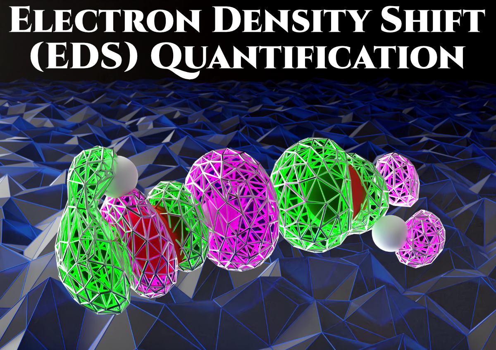

This script is designed to quantify the Electron Density Shift (EDS) calculated with Gaussian and contained in a cube file. The script calculates the EDS using the `eds_gaussian.sh` script and returns the total value of the EDS in the file and its value at a certain cutoff.

## Citation

This code is released under the MIT license. Commercial use, Modification, Distribution and Private use are all permitted. 
The use of theese scripts can be acknowledged with the following citation: 
Iribarren, Iñigo, Sanchez-Sanz, Goar, Alkorta, Ibon, Elguero, José, Trujillo, Cristina, *"Evaluation of electron density shifts in noncovalent interactions."* The Journal of Physical Chemistry A 125.22 (2021): 4741-4749. [DOI:10.1021/acs.jpca.1c00830](https://pubs.acs.org/doi/full/10.1021/acs.jpca.1c00830)

## Dependencies

To run the script, the following dependencies are required:

- `numpy`
- `pandas`
- `glob`
- `itertools`
- `argparse`
- `os`

## Usage

To use the script, run the following command in the terminal:

```
python3 eds_quatification -f <filename> -c <cutoff> -a
```

where `<filename>` is the path to the EDS cube file and `<cutoff>` is a float value representing the cutoff for the EDS calculations and `<a>` is an option to calculate the EDS for all the cub files in the working directory.

## Arguments

The script takes the following arguments:

- `<filename>` (str): Path to the EDS cube file.
- `<cutoff>` (float): Cutoff for the EDS calculations.
- `<a>` (boolean): Select for quantify all the cub files in the working directory

## Author information

This script was written by Inigo Iribarren. You can contact the author via email at `iribarri@tcd.ie`.

